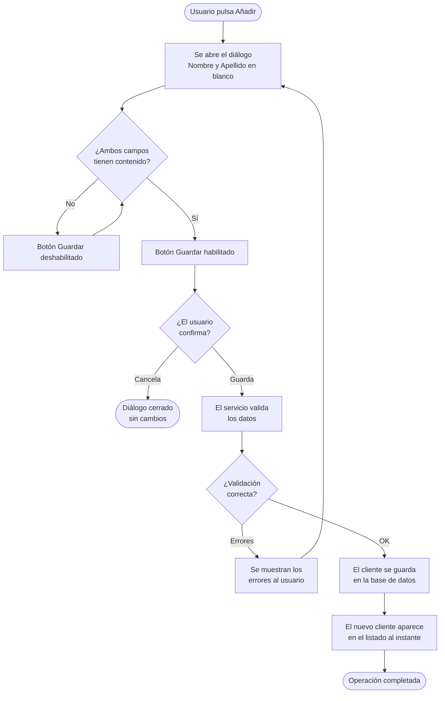

# Funcionalidades de la aplicación

Este documento describe las funcionalidades que ofrece **MVVMCleanArchitecture** al usuario final, así como los flujos internos que las sustentan.

---

## Gestión de clientes

La pantalla principal de la aplicación muestra el listado completo de clientes registrados. Sobre este listado el usuario puede realizar las siguientes operaciones:

### Visualizar clientes
- Al iniciar la aplicación se cargan automáticamente todos los clientes almacenados en la base de datos.
- Cada cliente muestra su **nombre** y **apellido**.
- El listado se actualiza de forma reactiva gracias al binding MVVM con `ObservableCollection<CustomerDto>`.

### Añadir un cliente
1. El usuario pulsa el botón **Añadir**.
2. Se abre el diálogo `CustomerDialog` con los campos **Nombre** y **Apellido** en blanco.
3. El botón **Guardar** del diálogo solo se habilita cuando ambos campos tienen contenido (validación en el ViewModel).
4. Al confirmar, el servicio valida el DTO con **FluentValidation** y persiste el registro en SQLite.
5. El nuevo cliente aparece en el listado sin necesidad de recargar la pantalla.



### Editar un cliente
1. El usuario selecciona un cliente del listado y pulsa **Editar**.
2. Se abre el mismo diálogo `CustomerDialog` con los datos actuales del cliente.
3. Al confirmar, el servicio actualiza el registro en base de datos.
4. El listado refleja el cambio inmediatamente.

### Eliminar un cliente
1. El usuario selecciona un cliente y pulsa **Eliminar**.
2. El servicio evalúa si existen **reglas de negocio** que impidan el borrado (p. ej., cliente con pedidos asociados).
3. Si existe algún impedimento, se muestra un mensaje de advertencia con el motivo devuelto por `Result<bool>.Failure(...)`.
4. Si no hay impedimento, el cliente se elimina de la base de datos y desaparece del listado.

---

## Gestión de pedidos

Los pedidos están **asociados a un cliente** y se gestionan desde el contexto del propio cliente.

- Cada `Customer` puede tener cero o más pedidos (`Order`).
- Los pedidos se añaden llamando al método de dominio `Customer.AddOrder(description)`, que encapsula la lógica de creación e impide descripciones vacías.
- El listado de pedidos de un cliente se puede consultar mediante `GetOrdersByCustomerIdAsync`.

### Crear un pedido

1. El usuario selecciona un cliente y pulsa **Añadir pedido** en la ventana principal.
1. El botón **Añadir pedido** solo está habilitado si el cliente seleccionado no es nulo.
1. Se abre un diálogo para introducir la descripción del pedido.
1. El botón **Guardar** solo se habilita cuando la descripción no está vacía.
1. Al confirmar, el servicio valida la descripción y persiste el pedido en la base de datos.
1. El nuevo pedido aparece en el listado del cliente inmediatamente.

---

## Flujos internos relevantes

### Inicio de la aplicación
```
App.OnStartup()
  ├── Host.Build() — configura DI, logging y servicios
  ├── db.Database.Migrate() — aplica migraciones pendientes de EF Core
  └── AppDbSeeder.Seed(db) — inserta datos iniciales si la base de datos está vacía
```

Datos de ejemplo que se insertan en la primera ejecución:

| Cliente | Pedidos |
|---|---|
| Alice Smith | Order A1, Order A2 |
| Bob Johnson | Order B1 |
| Charlie Williams | — |

### Validación y errores

- **Formularios**: no es posible guardar si los campos obligatorios están vacíos o superan la longitud permitida.
- **Operaciones**: antes de ejecutar acciones como borrar, se comprueba que no existan restricciones (p. ej., un cliente con pedidos no puede eliminarse).
- Los errores de formulario se muestran como una lista indicando qué campo corregir.
- Las restricciones de negocio se notifican con un aviso que explica el motivo.
- Cualquier error inesperado se informa al usuario sin que la aplicación se cierre.

---

## Datos técnicos

| Elemento | Detalle |
|---|---|
| Base de datos | SQLite — fichero `app.db` en el directorio de salida |
| Migraciones activas | `InitialCreate`, `AddCustomerLastName`, `AddCustomerLastNameValue` |
| Acceso a datos | `IDbContextFactory<AppDbContext>` — un `DbContext` por operación |
